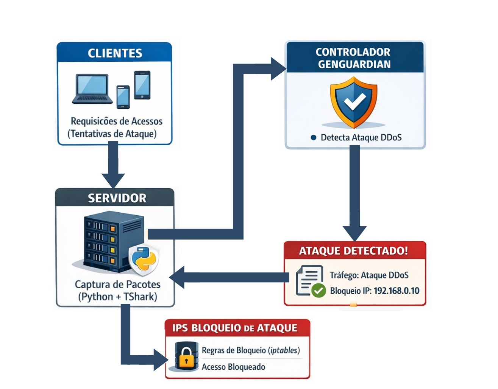

# GenGuardian

**GenGuardian** is an AI-powered intrusion detection and prevention
system that uses a fine-tuned Large Language Model (LLM) to detect
Distributed Denial of Service (DDoS) attacks in real time.

This repository contains the implementation developed as part of the
following research project:

> *"GenGuardian: DDoS Detection Using LLaMA Models with Fine-Tuning and
> Quantization"*\
> Bachelor's Thesis --- CEFET/RJ, 2026

------------------------------------------------------------------------

# Overview

Traditional intrusion detection systems rely on statistical analysis or
classical machine learning approaches. GenGuardian takes a different
path: it leverages a **fine-tuned LLaMA model** to analyze structured
network flow data and classify traffic as benign or malicious.

The system is designed to be **lightweight and deployable**, capable of
running even in environments with limited computational resources thanks
to **4-bit quantization via QLoRA**.

------------------------------------------------------------------------

# System Architecture

The following diagram illustrates the main workflow of the GenGuardian
system.

1.  Clients send requests to the server.
2.  The server captures network packets using **Python and TShark**.
3.  Captured traffic features are forwarded to the **GenGuardian
    Controller**.
4.  The fine-tuned **LLaMA model** analyzes the traffic.
5.  If malicious activity is detected, mitigation actions are triggered.
6.  The system blocks the attacker IP using **iptables firewall rules**.

------------------------------------------------------------------------

# Experimental Environment

The experimental setup used to evaluate the system is shown below.

The experiment was executed in a controlled virtualized network
environment consisting of:

-   **Windows Host Machine**
    -   Running the LLaMA inference API.
-   **Ubuntu Server VM (192.168.56.3)**
    -   Target server responsible for packet capture and attack
        detection.
-   **Ubuntu Attacker VM (192.168.56.2)**
    -   Generates DDoS attack traffic against the server.

All machines communicate through a **Host-Only Virtual Network**,
allowing controlled attack simulation and traffic analysis.

------------------------------------------------------------------------

# Key Features

-   DDoS detection using a **fine-tuned LLaMA 3.2 (1B)** model
-   Lightweight inference via **4-bit quantization (QLoRA)**
-   Real-time network traffic analysis
-   Integration with packet capture tools (**TShark**)
-   Automatic mitigation through **iptables firewall rules**
-   Designed for research in **AI-driven cybersecurity**

------------------------------------------------------------------------

# Model

  Property          Value
  ----------------- ---------------------------------------
  Base Model        LLaMA 3.2 -- 1B parameters
  Training Method   Supervised Fine-Tuning (SFT)
  Optimization      QLoRA (Quantized Low-Rank Adaptation)
  Quantization      4-bit

This configuration enables local execution while maintaining strong
detection performance.

------------------------------------------------------------------------

# Dataset

Training and evaluation were performed using the **CICDDoS2019
Dataset**, provided by the Canadian Institute for Cybersecurity.

Dataset page:\
https://www.unb.ca/cic/datasets/ddos-2019.html

Selected features used in the experiments:

-   Flow Duration
-   Flow Packets/s
-   Avg Fwd Segment Size
-   Average Packet Size
-   Init_Win_bytes_forward

The dataset was balanced using **undersampling** to avoid bias toward
the majority class.

------------------------------------------------------------------------

# Experiments

Three experimental scenarios were evaluated:

  Scenario   Description
  ---------- ------------------------------
  1          Zero-shot LLM classification
  2          Prompt engineering
  3          Fine-tuned model

The fine-tuned model significantly outperformed the base model,
achieving **over 98% detection accuracy** in multiple attack detection
scenarios.

------------------------------------------------------------------------

# Tech Stack

-   **Python** --- Core pipeline and data processing\
-   **FastAPI** --- Controller API\
-   **PyTorch + Transformers** --- Model training and inference\
-   **QLoRA / PEFT** --- Efficient fine-tuning\
-   **TShark** --- Network traffic capture\
-   **iptables** --- Firewall-based mitigation

------------------------------------------------------------------------

# Example Workflow

    1. Capture network traffic with TShark
    2. Extract flow features from captured packets
    3. Convert structured network data into prompt format
    4. Query the fine-tuned LLaMA model
    5. Parse the classification result (benign / malicious)
    6. Apply mitigation rules if an attack is detected

------------------------------------------------------------------------

# Research Context

This project was developed as a **Bachelor's Thesis in Computer
Engineering** at:

**CEFET/RJ --- Centro Federal de Educação Tecnológica Celso Suckow da
Fonseca**

  Role      Name
  --------- ---------------------------------
  Author    Pedro Carneiro Pizzi
  Advisor   Prof. Dalbert Matos Mascarenhas

------------------------------------------------------------------------

# Future Work

Possible improvements include:

-   Real-time deployment in production environments
-   Integration with **SDN controllers**
-   Detection of additional attack types
-   Training on larger multi-class datasets
-   Automated and adaptive response policies

------------------------------------------------------------------------

# Acknowledgements

## Dataset

Experiments were conducted using the **CICDDoS2019 dataset**, provided
by the Canadian Institute for Cybersecurity.

https://www.unb.ca/cic/datasets/ddos-2019.html

## Model

This project uses models from the **LLaMA family**, developed by Meta
and distributed under the **LLaMA Community License Agreement**.

More information:

https://ai.meta.com/llama/license/

------------------------------------------------------------------------

# Citation

If you use this project in academic research, please cite:

Pizzi, Pedro.\
GenGuardian: DDoS Detection Using LLaMA Models with Fine-Tuning and
Quantization.\
Bachelor's Thesis -- CEFET/RJ, 2026.

------------------------------------------------------------------------

# Contact

**Pedro Carneiro Pizzi**

-   LinkedIn
-   GitHub
